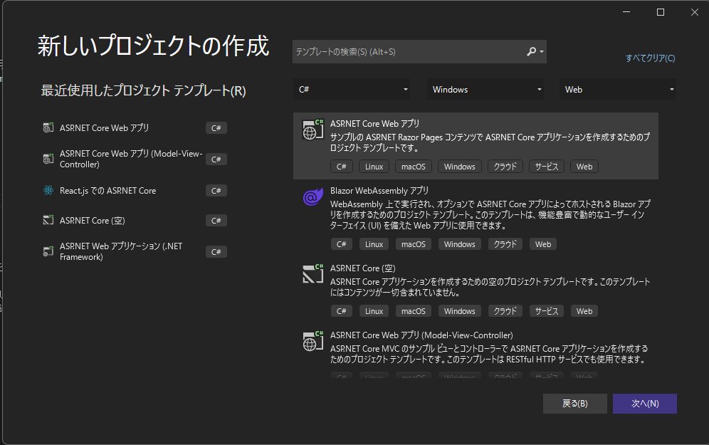

# webpackを使わずにASP.NET(Razor pages) で TypeScript + jQuery を利用する

ASP.NET MVCでもTypeScriptを使ってコーディングをしたいと思いましたが、自分の思うような例がなかったためサンプルを作成しました。

※Visual Studio 2022で確認しています

https://github.com/murasuke/RazorPagesWithTypeScript

## 要件

1. 面倒な設定はできる限り行わない
    * ビルドスクリプト(gulp)やバンドラー(webpack)を利用せずに複数.jsファイルを利用する
1. jQueryを利用可能とする
    * jQueryは&lt;script&gt;タグでは読み込まず、各jsファイルでimportして利用する。
1. Visual Studioでプログラムを実行する際、`F5`キーのみで実行できる状態にする
    * gulpなどのタスクランナーも利用しない
1. Pageとjs(ts)ファイルを1:1の関係にする。各ページで対応関係にあるスクリプトファイルのみを読み込むようにする。


## 実現方法

一言で言うと、TypeScriptのモジュール形式を`AMD`にして、ブラウザ側から`RequireJS`でロードすることで実現します。

### 要件1. 2. について

TypeScriptを利用する場合、ブラウザ側での依存解決のためトランスパイルしたjsファイルと依存モジュールを１ファイルにまとめる`バンドル`処理が必要になります。
しかし[webpack](https://webpack.js.org/)などのバンドラーは設定が難しく、本質的なことを始める前に挫折する原因になるため今回は利用しません。

バンドラーを利用せずに別のJSファイル利用する方法として、下記の方法があります。
1. ESModules 形式のモジュールを`import`で利用
1. AMDモジュールを[RequireJS](https://requirejs.org/)経由で利用

ESModule形式であれば、ブラウザ側でimportをするとサーバから必要なjsファイルを取得してくれるため、非常に簡単に処理することができます。ところが、jQueryがESModule形式をサポートしていないため、利用することができません。

幸いなことに、jQueryはAMDモジュールとして利用可能なため、[RequireJS](https://requirejs.org/)による動的読み込み形式を利用することとします。

### 要件3. について

TypeScriptファイルを保存すると自動でjsファイルにコンパイルしてくれるツール`Microsoft.TypeScript.MSBuild`を導入します。(保存先などトランスパイル時の設定は後で説明(tsconfig.json)します)


### 要件4. について

各ページ毎に作成した.tsファイルを`@section scripts{～}`で読み込みます。
tsファイル内で`import $ from 'jquery'`とすれば、RequireJSが動的にロードしてくれるため、各ページでjqueryを読み込む必要はありません。

```html
@section scripts {
 <script data-main="other.js" src="~/js/lib/require.js" asp-append-version="true"></script>
}
```

* other.ts

```typescript
import $ from 'jquery';
import { currentDate } from "testlib";

// タイマーで画面の時刻を更新
$(() => {
    $("#currentDate").text(currentDate());
    setInterval(() => {
        $("#currentDate").text(currentDate());
    }, 1000);
});
```

## 制限事項

* npm でインストールするモジュールは基本的に利用不可
  * 読み込みがRequireJSに依存しているため、CommonJS形式のモジュールは利用不可です(AMDやUMD形式のモジュールは利用できます)

## 実装手順

最終的に下記のようなファイル構成になります。(トランスパイルされたtsファイルがjsフォルダに入ります)

;

### 1. Razor pagesプロジェクトを作成する

新しいプロジェクトの作成から`ASP.NET Core Web アプリ`を選択します。

;

### 2. TypeScript関連設定

* TypeScriptを保存するフォルダ(`scripts/js`)を作成します。

`scripts`直下ではなく`/js`の下にファイルを作成します。RequireJSでファイルをロードする際、`/js`フォルダに入れておくと読み込みやすいためです(baseURLの制限)

* `tsconfig.tson`を追加します。

```json
{
  "compileOnSave": true,
  "compilerOptions": {
    "noImplicitAny": false,
    "noEmitOnError": true,
    "removeComments": false,
    "target": "ES2015",
    "module": "AMD",
    "outDir": "wwwroot/js",
    "allowSyntheticDefaultImports": true,
    "esModuleInterop": true
  },
  "include": ["scripts/**/*"]
}
```
特に重要な設定
|  項目  |  説明  |
| ---- | ---- |
|  module  |  AMD形式で出力  |
|  outDir  |  トランスパイルしたjsの保存先  |
|  allowSyntheticDefaultImports  |  jQuery利用のために必要  |
|  esModuleInterop  |  jQuery利用のために必要  |


* `Microsoft.TypeScript.MSBuild`をインストール(.tsファイル保存時に自動でトランスパイル)

;

* NuGetパッケージマネージャを起動して、検索欄に`Microsoft.TypeScript.MSBuild`を入力してインストールします。保存先などコンパイル時の設定は`tsconfig.tson`に従います。

;


### jQueryのインストール

jQueryと型定義をインストールします。npmで`package.json`のひな形を作成(`npm init`)後、jQueryと型定義を追加します。

```bash
npm init -y
npm i jquery @types/jquery
```

jQueryのソースファイルを`wwwroot/js/lib/`にコピーする(フォルダは適宜作成してください)

jQueryのソースは下記フォルダに配置されています。
`node_modules\jquery\dist\jquery.min.js`


### RequireJSの設定

`site.js`ファイル(全ページで共通に読み込まれる.jsファイル)で`baseUrl`を設定します。jsファイルは`/js`フォルダ配下から読み込みます。
未指定の場合、プロジェクトルート直下から.jsファイルを読み込もうとして`404 not found(ファイルが見つからない)`となります。

```javascript
var require = {
    baseUrl: "js",
    paths: {
        'jquery': 'lib/jquery.min'
    }
};
```


## 動作確認用ページ、TypeScriptソース

## indexページ

jQueryでボタンクリックイベントをバインドするサンプル。別.tsファイル(testlib.ts)からclass、interfaceを世読み込み、利用しています。


* index.ts

```typescript
import $ from 'jquery';
import { Student, Person } from './testlib';

const greeter = (person: Person) => {
    return `Hello, ${person.firstName} ${person.lastName}`;
}

 const TSButton = () => {
    const firstname = $('#firstname').val() as string;
    const lastname = $('#lastname').val() as string;
    const user = new Student(firstname, lastname);
    $("#result").html(greeter(user))
}

// ボタンにclickイベントハンドラを設定
$('#btnClickMe').on('click', TSButton);

// グローバルスコープに公開(onclick="TSButton()" で利用できる)
window['TSButton'] = TSButton;
```

* index.cshtml

`@section scripts`でスクリプトファイルを読み込んでいます。

```html
@page
@model IndexModel
@{
    ViewData["Title"] = "jQueryでクリックイベント付与";
}

@section scripts {
 <script data-main="index.js" src="~/js/lib/require.js" asp-append-version="true"></script>
}

<div class="text-center">

    <div class="my-2">
        <div class="input-group">
          <span class="input-group-text">First and last name</span>
          <input type="text" id="firstname" aria-label="First name" class="form-control" value="first" />
          <input type="text" id="lastname" aria-label="Last name" class="form-control" value="last" />
        </div>
        <div id="result">　</div>
    </div>


    <button id="btnClickMe" class="btn-primary btn-md" >
        $("#btnClickMe").on("click", TSButton);
    </button>

    <button class="btn-secondly btn-md" onclick="TSButton()" >
        onclick="TSButton()"
    </button>

    <div class="my-2">
        <a asp-page="./other">Otherページ</a>
    </div>
</div>

```

## otherページ

ページを切り替えて、スクリプトが切り替わることを確認するサンプル。ページ読み込み時にタイマーで時刻を更新するスクリプトを実行しています。


* other.ts

```typescript
import $ from 'jquery';
import { currentDate } from "testlib";

// タイマーで画面の時刻を更新
$(() => {
    $("#currentDate").text(currentDate());
    setInterval(() => {
        $("#currentDate").text(currentDate());
    }, 1000);
});
```
* other.cshtml

`@section scripts`でスクリプトファイルを読み込んでいます。


```html
@page
@model RazorPagesWithTypeScript.Pages.OtherModel
@{
    ViewData["Title"] = "ページ毎に読み込むスクリプトを切り替え";
}

@section scripts {
 <script data-main="other.js" src="~/js/lib/require.js" asp-append-version="true"></script>
}
<div class="text-center">
    現在時刻：
    <span id="currentDate"/>
</div>

<div class="my-2">
    <a asp-page="index">Top(index)ページ </a>
</div>
```

* Shared/_Layout.cshtml

共通ページ。`@await RenderSectionAsync`の位置で、各ページの`@section scripts`が出力されます。

```html
<!DOCTYPE html>
<html lang="ja">
<head>
    <meta charset="utf-8" />
    <meta name="viewport" content="width=device-width, initial-scale=1.0" />
    <title>@ViewData["Title"]</title>
    <link rel="stylesheet" href="~/lib/bootstrap/dist/css/bootstrap.min.css" />
    <link rel="stylesheet" href="~/css/site.css" asp-append-version="true" />
</head>
<body>
    <div class="container">
        <h4 class="display-8" >ASP.NET(Razor pages) + TypeScript + JQuery サンプル</h4>
        <div>(@ViewData["Title"])</div>
         @RenderBody()
    </div>

    <script src="~/js/site.js" asp-append-version="true"></script>
    @await RenderSectionAsync("Scripts", required: false)
</body>
</html>
```

